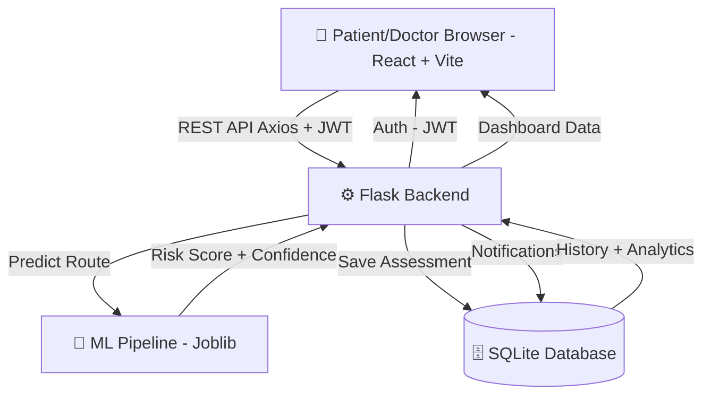
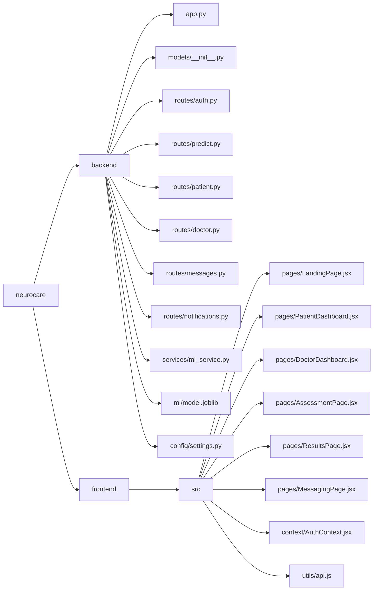

# 🧠 NeuroCare AI
### AI-Powered Stroke Risk Prediction & Neural Health Monitoring


## 🌐 Live Demo
👉 👉 **https://neural-stroke-care-delta.vercel.app**

---

## 📋 Table of Contents
- [Overview](#overview)
- [Features](#features)
- [Tech Stack](#tech-stack)
- [Architecture](#architecture)
- [Project Structure](#project-structure)
- [ML Model](#ml-model)
- [API Reference](#api-reference)
- [Environment Variables](#environment-variables)
- [Running Locally](#running-locally)

---

## 🔍 Overview
NeuroCare AI is a full-stack futuristic healthcare web application focused on **stroke risk prediction and neural health monitoring**. Patients fill a multi-step health assessment form, and a trained Machine Learning model predicts their stroke risk probability with confidence scores and personalized recommendations. Doctors can monitor high-risk patients, toggle availability, and communicate via an in-app messaging system.

---

## ✨ Features

### 🩺 Patient
- 🧠 **AI Stroke Risk Assessment** — Multi-step health form with instant ML prediction
- 📊 **Risk Dashboard** — Visual risk gauge, confidence score, trend charts
- 📋 **Assessment History** — Search, filter, and download past reports
- 💬 **Doctor Messaging** — Direct chat with available doctors
- 🚨 **Emergency Support** — One-tap emergency call, nearby hospitals, BE-FAST guide
- 🔔 **Smart Notifications** — Assessment alerts, doctor replies

### 👨‍⚕️ Doctor
- 👥 **Patient Monitoring** — View all patients with latest risk levels
- 🚨 **High Risk Alerts** — Instant view of critical patients
- 🟢 **Availability Toggle** — Go online/offline for patient messaging
- 💬 **Patient Messaging** — Communicate directly with patients

### 🔐 Auth
- JWT-based authentication
- Separate Patient & Doctor roles
- Protected routes on both frontend and backend

---

## 🛠 Tech Stack

| Layer | Technology |
|-------|-----------|
| Frontend | React 18, Vite, Tailwind CSS, Framer Motion |
| Backend | Flask, Flask-JWT-Extended, SQLAlchemy |
| Database | SQLite (PostgreSQL-ready) |
| ML Model | Scikit-Learn, SMOTE, Logistic Regression, Joblib |
| Charts | Recharts |
| Icons | React Icons |
| Deployment | Vercel (Frontend), Render (Backend) |

---

## 🏗 Architecture



---

## 📁 Project Structure



---

## 🤖 ML Model

| Property | Details |
|----------|---------|
| Algorithm | Logistic Regression |
| Balancing | SMOTE (sampling_strategy=0.6) |
| Preprocessing | OneHotEncoder for categorical features |
| Pipeline | Scikit-Learn ImbPipeline |
| Threshold | 0.40 (optimized for high recall) |
| AUC Score | ~0.98 |
| Recall | ~95% at 0.40 threshold |
| Format | Joblib (.joblib) |

### Input Features
| Feature | Type |
|---------|------|
| age | Numeric |
| bmi | Numeric |
| avg_glucose_level | Numeric |
| hypertension | Binary (0/1) |
| heart_disease | Binary (0/1) |
| gender | Categorical |
| ever_married | Categorical |
| work_type | Categorical |
| Residence_type | Categorical |
| smoking_status | Categorical |

---

## 📡 API Reference

### Auth
| Method | Endpoint | Description |
|--------|----------|-------------|
| POST | /api/signup | Register patient or doctor |
| POST | /api/login | Login and get JWT |
| GET | /api/me | Get current user profile |
| POST | /api/logout | Logout |

### Patient
| Method | Endpoint | Description |
|--------|----------|-------------|
| POST | /api/predict | Run ML stroke prediction |
| GET | /api/history | Get assessment history |
| GET | /api/analytics | Get health trend data |
| GET/PUT | /api/profile | View/update profile |

### Doctor
| Method | Endpoint | Description |
|--------|----------|-------------|
| GET | /api/doctor/patients | All patients list |
| GET | /api/doctor/high-risk | High risk patients |
| PUT | /api/doctor/status | Toggle availability |

### Messages & Notifications
| Method | Endpoint | Description |
|--------|----------|-------------|
| POST | /api/messages | Send message |
| GET | /api/messages/:id | Get conversation |
| GET | /api/notifications | Get notifications |
| PUT | /api/notifications/read-all | Mark all read |

---

## 🗄 Database Models

| Model | Description |
|-------|-------------|
| User | Auth — email, password hash, role |
| Patient | Profile — name, age, gender, blood group |
| Doctor | Profile — specialization, hospital, availability |
| Assessment | Health inputs + ML prediction results |
| Message | Patient-doctor messages |
| Notification | System alerts and notifications |

---

## 🔐 Environment Variables

### backend/.env
```
SECRET_KEY=your-secret-key
JWT_SECRET_KEY=your-jwt-secret
DATABASE_URL=sqlite:///neurocare.db
ML_MODEL_PATH=ml/model.joblib
```

⚠️ Never commit .env files to version control!

---

## 🚀 Running Locally

### Backend
```bash
cd backend
python -m venv venv
venv\Scripts\activate        # Windows
pip install -r requirements.txt
pip install imbalanced-learn
cp .env.example .env
python app.py
```

### Frontend
```bash
cd frontend
npm install
npm run dev
```

Visit: **http://localhost:5173**

---

## 🌍 Deployment

| Service | Platform | URL |
|---------|----------|-----|
| Frontend | Vercel | 👉 **https://neural-stroke-care-delta.vercel.app** |
| Backend | Render | https://********.onrender.com |
| Database | SQLite → PostgreSQL | Cloud Ready |

---

## 👨‍💻 Author
**Aditya Bhardwaj**
- GitHub: [@Aditya-Bhardwaj-jod](https://github.com/Aditya-Bhardwaj-jod)

---

Built with ❤️ using React · Flask · Scikit-Learn · SQLite · JWT · Framer Motion
